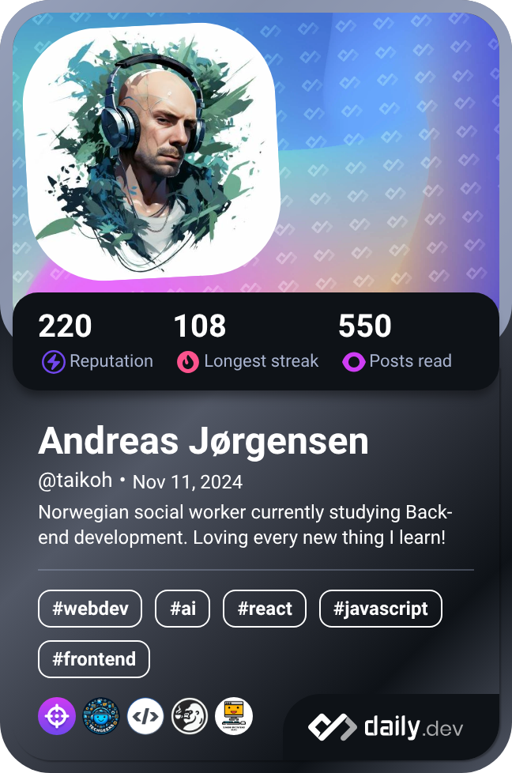

  <ul align="center" style="list-style: none">
    

      <h1>
        👋 Hi, my name is Andreas Jørgensen
      </h1>
    

  </ul>

<h3 align="center">I'm an aspiring <b>Back-end Developer</b> from Stavanger, Norway, currently honing my skills at <b>Noroff School of Technology and Digital Media.</b> With a passion for building efficient, scalable solutions, I'm diving deep into server-side technologies and database management.

Feel free to explore my projects and connect with me—I'm always excited to collaborate and learn! 🚀</h3> 
### Socials

 <a href="https://www.dev.to/andreas_jrgensen_0325b93" target="_blank" rel="noreferrer"> <picture> <source media="(prefers-color-scheme: dark)" srcset="https://raw.githubusercontent.com/danielcranney/readme-generator/main/public/icons/socials/devdotto-dark.svg" /> <source media="(prefers-color-scheme: light)" srcset="https://raw.githubusercontent.com/danielcranney/readme-generator/main/public/icons/socials/devdotto.svg" />  </picture> </a> <a href="https://www.github.com/taikoh" target="_blank" rel="noreferrer"> <picture> <source media="(prefers-color-scheme: dark)" srcset="https://raw.githubusercontent.com/danielcranney/readme-generator/main/public/icons/socials/github-dark.svg" /> <source media="(prefers-color-scheme: light)" srcset="https://raw.githubusercontent.com/danielcranney/readme-generator/main/public/icons/socials/github.svg" />  </picture> </a> <a href="https://www.linkedin.com/in/andreas-høisæth-jørgensen-1b96a28b/" target="_blank" rel="noreferrer"> <picture> <source media="(prefers-color-scheme: dark)" srcset="https://raw.githubusercontent.com/danielcranney/readme-generator/main/public/icons/socials/linkedin-dark.svg" /> <source media="(prefers-color-scheme: light)" srcset="https://raw.githubusercontent.com/danielcranney/readme-generator/main/public/icons/socials/linkedin.svg" />  </picture> </a>
 

==============================================

* 🌍  I'm based in Stavanger, Norway
* ✉️  You can contact me at [ah.joergensen90@gmail.com](mailto:ah.joergensen90@gmail.com)
* 🧠  I'm currently learning jQuery and Bootstrap.
* 🤝  I'm open to collaborating on interesting javascript, html and css projects.
  
    

      
    

### Skills

### Badges

<b>My GitHub Stats</b>

